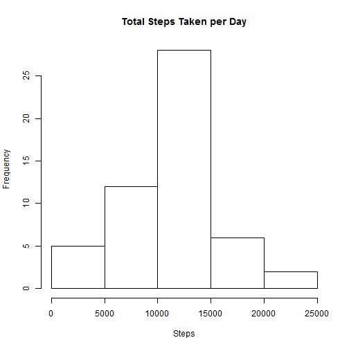
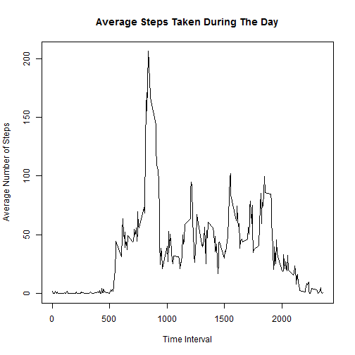
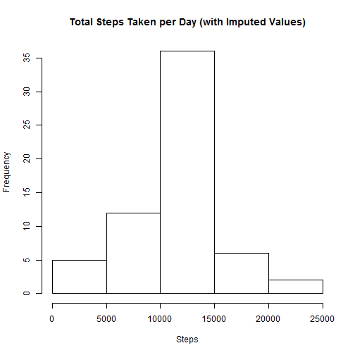

## Loading and preprocessing the data

Here we read in the data file, and then convert the dates from a factor variable into the Date format.


```r
activity <- read.csv("activity.csv")
activity$date <- as.Date(activity$date)
```

## What is mean total number of steps taken per day?

Next we calculate the total number of steps taken each day, ignoring any missing values. 


```r
activity.NA.RM <- subset(activity, !is.na(activity$steps))
dailySteps <- tapply(activity.NA.RM$steps, activity.NA.RM$date, sum)
```

First we calculate the mean and median of this data:


```r
mean(dailySteps)
```

```
## [1] 10766.19
```

```r
median(dailySteps)
```

```
## [1] 10765
```

Now we plot a histogram of it:


```r
hist(dailySteps, main="Total Steps Taken per Day", xlab="Steps")
```

 

## What is the average daily activity pattern?

Now we will take a look at the pattern of steps taken throughout the day, still ignoring missing values. Here is a time series plot of that data:


```r
intervals <- as.numeric(levels(factor(activity.NA.RM$interval)))
avgSteps <- tapply(activity.NA.RM$steps, activity.NA.RM$interval, mean)
plot(intervals, avgSteps, type="l", main="Average Steps Taken During The Day", 
     xlab="Time Interval", ylab="Average Number of Steps")
```

 

We can see which interval, on average, contained the most steps taken:


```r
intervals[which.max(avgSteps)]
```

```
## [1] 835
```

## Imputing missing values

Now we decide how to handle missing values. First let's compute the total number of missing values in our data:


```r
sum(is.na(activity$steps))
```

```
## [1] 2304
```

For a given missing value, let us impute the mean for that 5 minute interval for all of the data, and again calculate the number of steps taken each day.


```r
activity_imputed <- activity

for (index in which(is.na(activity$steps))) {
    activity_imputed$steps[index] <- 
        avgSteps[which(intervals == activity$interval[index])]
}

dailySteps_imputed <- tapply(activity_imputed$steps, activity_imputed$date, sum)
```

Now let's look at the mean and median of this new data:


```r
mean(dailySteps_imputed)
```

```
## [1] 10766.19
```

```r
median(dailySteps_imputed)
```

```
## [1] 10766.19
```

Now we plot a histogram of it:


```r
hist(dailySteps_imputed,
     main="Total Steps Taken per Day (with Imputed Values)", xlab="Steps")
```

 

We notice that, as expected, the mean remains unchanged. However, because we used the mean of each interval as our imputed values, the median is now equal to the mean.

## Are there differences in activity patterns between weekdays and weekends?

Now we will investigate whether there is a relationship between weekend/weekday and number of steps taken. First we determine which days are weekends and which are weekdays. 


```r
activity_imputed$dayofweek <- weekdays(activity_imputed$date)
activity_imputed$dayofweek[which(activity_imputed$dayofweek == "Saturday" | 
                          activity_imputed$dayofweek == "Sunday")] <- "weekend"
activity_imputed$dayofweek[which(activity_imputed$dayofweek != "weekend")] <-
                                                                    "weekday"
activity_imputed$dayofweek <- as.factor(activity_imputed$dayofweek)
```

Now we can plot the results:


```r
library(lattice)
nInts <- length(intervals)

df <- data.frame("interval" = rep(intervals, 2))
df$dayofweek <- as.factor(c(rep("weekend",nInts),rep("weekday", nInts)))

weekendData <- subset(activity_imputed, dayofweek == "weekend")
weekdayData <- subset(activity_imputed, dayofweek == "weekday")
weekendAvgs <- tapply(weekendData$steps, weekendData$interval, mean)
weekdayAvgs <- tapply(weekdayData$steps, weekdayData$interval, mean)

df$avgs <- c(weekendAvgs, weekdayAvgs)

xyplot(avgs ~  interval | dayofweek, data = df, layout = c(1,2), type="l", ylab="Number of steps")
```

 
